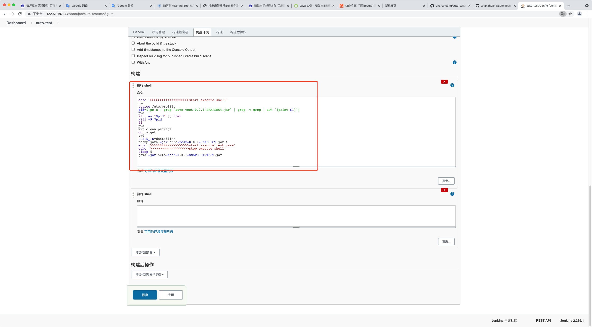

# httpClient + testNG + jenkins 实现自动化测试及报告的生成

## 本地启动
+ 1.IDEA插件执行`maven package`，会在`auto-test`目录下面生成`target`目录,`target`目录下会多生成一个test jar包
+ 2.有一些test case执行需要 `auto-test-0.0.1-SNAPSHOT.jar`在运行状态
    + 2.1 在`target`目录下执行 `java -jar auto-test-0.0.1-SNAPSHOT-TEST.jar` 会找到`AutoTestApplicationTests`启动并执行test case
+ 3.在工作空间下会生成测试报告`my-workspace/auto-test/target/test-output/福寿康管理系统自动化测试报告.html`

## 结合Jenkins
+ 1.安装Jenkins
+ 2.配置Jenkins


  



```shell
echo '>>>>>>>>>>>>>>>>>>>>start execute shell'
pwd
source /etc/profile
pid=$(ps x | grep "auto-test-0.0.1-SNAPSHOT.jar" | grep -v grep | awk '{print $1}')
pwd
if [ -n "$pid" ]; then
kill -9 $pid
fi
pwd
mvn clean package
cd target
pwd
BUILD_ID=dontKillMe
nohup java -jar auto-test-0.0.1-SNAPSHOT.jar &
# 睡眠10秒钟是为了保证auto-test-0.0.1-SNAPSHOT.jar启动
# 写的比较笨,后续优化
sleep 10
java -jar auto-test-0.0.1-SNAPSHOT-TEST.jar
echo '>>>>>>>>>>>>>>>>>>>>stop execute shell'
```


+ 3.常见问题
    + 3.1 git拉取github代码速度比较慢,使用镜像访问,配置机器hosts文件
