# httpClient + testNG + jenkins 实现自动化测试及报告的生成
## 目录
+ **[1.介绍](#1.介绍)**

## 1.介绍
### 1.1项目结构
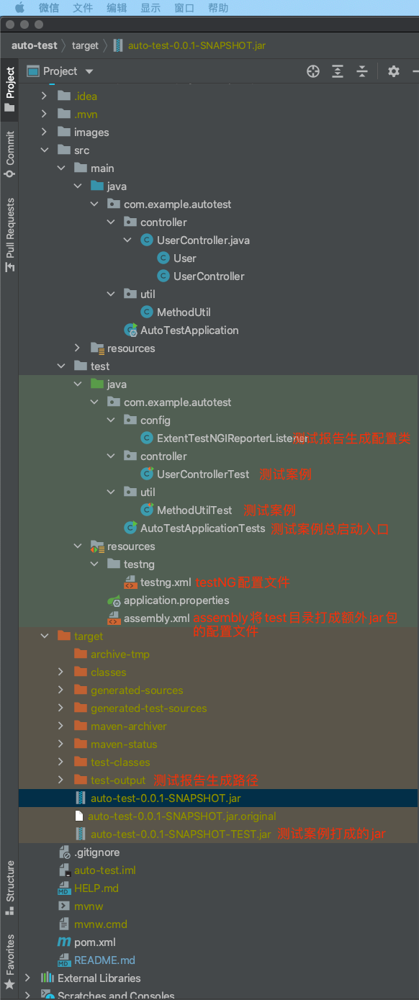
### 1.2POM依赖
```XML
<?xml version="1.0" encoding="UTF-8"?>
<project xmlns="http://maven.apache.org/POM/4.0.0" xmlns:xsi="http://www.w3.org/2001/XMLSchema-instance"
         xsi:schemaLocation="http://maven.apache.org/POM/4.0.0 https://maven.apache.org/xsd/maven-4.0.0.xsd">
    <modelVersion>4.0.0</modelVersion>
    <parent>
        <groupId>org.springframework.boot</groupId>
        <artifactId>spring-boot-starter-parent</artifactId>
        <version>2.5.1</version>
        <relativePath/>
    </parent>
    <groupId>com.example</groupId>
    <artifactId>auto-test</artifactId>
    <version>0.0.1-SNAPSHOT</version>
    <name>auto-test</name>
    <description>Demo project for Spring Boot</description>
    <properties>
        <java.version>1.8</java.version>
        <!--    打包会编译，只是在打包的时候不执行test case    -->
        <skipTests>true</skipTests>
        <!--    打包会编译，只是在打包的时候不执行test case    -->
    </properties>
    <dependencies>

        <dependency>
            <groupId>org.springframework.boot</groupId>
            <artifactId>spring-boot-starter</artifactId>
        </dependency>
        <dependency>
            <groupId>org.springframework.boot</groupId>
            <artifactId>spring-boot-starter-web</artifactId>
        </dependency>

        <dependency>
            <groupId>org.springframework.boot</groupId>
            <artifactId>spring-boot-starter-test</artifactId>
            <scope>compile</scope>
        </dependency>

        <!--    testng + httpclient + 生成测试报告所需依赖    -->
        <dependency>
            <groupId>org.apache.httpcomponents</groupId>
            <artifactId>httpclient</artifactId>
            <version>4.5.13</version>
        </dependency>
        <dependency>
            <groupId>org.testng</groupId>
            <artifactId>testng</artifactId>
            <version>RELEASE</version>
            <scope>compile</scope>
        </dependency>
        <dependency>
            <groupId>com.relevantcodes</groupId>
            <artifactId>extentreports</artifactId>
            <version>2.41.1</version>
        </dependency>
        <dependency>
            <groupId>com.vimalselvam</groupId>
            <artifactId>testng-extentsreport</artifactId>
            <version>1.3.1</version>
        </dependency>
        <dependency>
            <groupId>com.aventstack</groupId>
            <artifactId>extentreports</artifactId>
            <version>3.0.6</version>
        </dependency>
        <dependency>
            <groupId>org.apache.httpcomponents</groupId>
            <artifactId>httpclient</artifactId>
        </dependency>
        <!--    testng + httpclient + 生成测试报告所需依赖    -->
        <!--    将test打成jar包所需依赖    -->
        <dependency>
            <groupId>com.beust</groupId>
            <artifactId>jcommander</artifactId>
            <version>1.81</version>
        </dependency>
        <!--    将test打成jar包所需依赖    -->

    </dependencies>

    <build>
        <plugins>
            <plugin>
                <groupId>org.springframework.boot</groupId>
                <artifactId>spring-boot-maven-plugin</artifactId>
                <version>2.5.1</version>
            </plugin>
            <!--      将test目录打包配置      -->
            <plugin>
                <groupId>org.apache.maven.plugins</groupId>
                <artifactId>maven-assembly-plugin</artifactId>
                <version>2.3</version>
                <configuration>
                    <descriptor>src/test/resources/assembly.xml</descriptor>
                </configuration>
                <executions>
                    <execution>
                        <id>make-assembly</id>
                        <phase>package</phase>
                        <goals>
                            <goal>single</goal>
                        </goals>
                        <configuration>
                            <archive>
                                <manifest>
                                    <mainClass>com.example.autotest.AutoTestApplicationTests</mainClass>
                                </manifest>
                            </archive>
                        </configuration>
                    </execution>
                </executions>
            </plugin>
            <!--      将test目录打包配置      -->
        </plugins>
    </build>

</project>

```
## 2.启动
### 2.1本地启动
+ 1.IDEA插件或者其他方式执行`maven package`,会在`auto-test`目录下面生成`target`目录。因为我们在POM文件中增加了将test打包的配置,`target`目录下会多出来一个`auto-test-0.0.1-SNAPSHOT-TEST.jar`
  
+ 2.命令行执行`java -jar auto-test-0.0.1-SNAPSHOT.jar`或者其他方式启动`auto-test-0.0.1-SNAPSHOT.jar`.有一些test case,例如接口测试需要接口已经启动,所以在执行测试案例之前确保 `auto-test-0.0.1-SNAPSHOT.jar`在运行状态
  
+ 3.在`target`目录下执行 `java -jar auto-test-0.0.1-SNAPSHOT-TEST.jar` 会找到`AutoTestApplicationTests`启动并执行test case
    
+ 4.在工作空间下会生成测试报告`auto-test/target/test-output/福寿康管理系统自动化测试报告.html`

### 2.2结合Jenkins使用
+ 1.安装Jenkins略过
+ 2.配置Jenkins

登录Jenkins后新建一个任务,如下所示
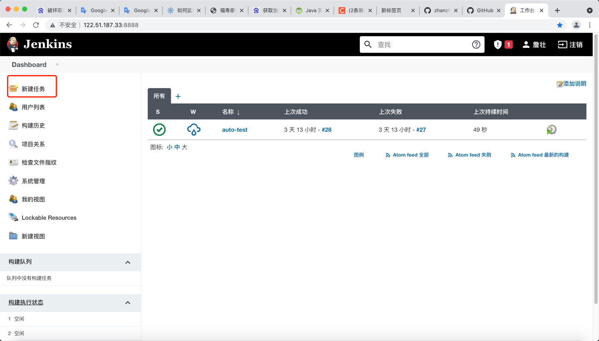

填写一个任务名称,选择构建一个自由风格的软件项目后点击确定,如下所示
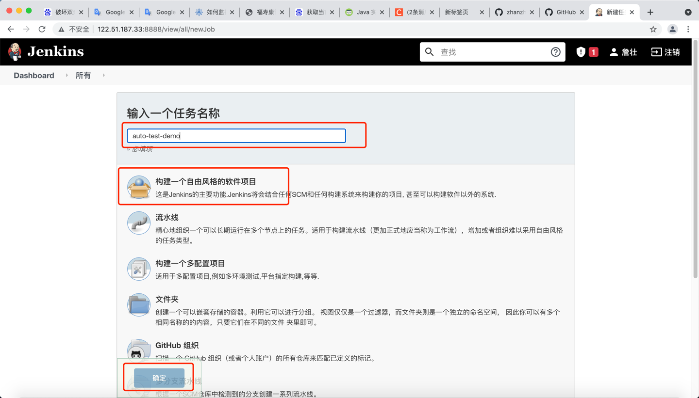

源码管理处选择Git,Respository URL填写GIT地址(这里我用的是github).在下方添加一个证书,如下所示
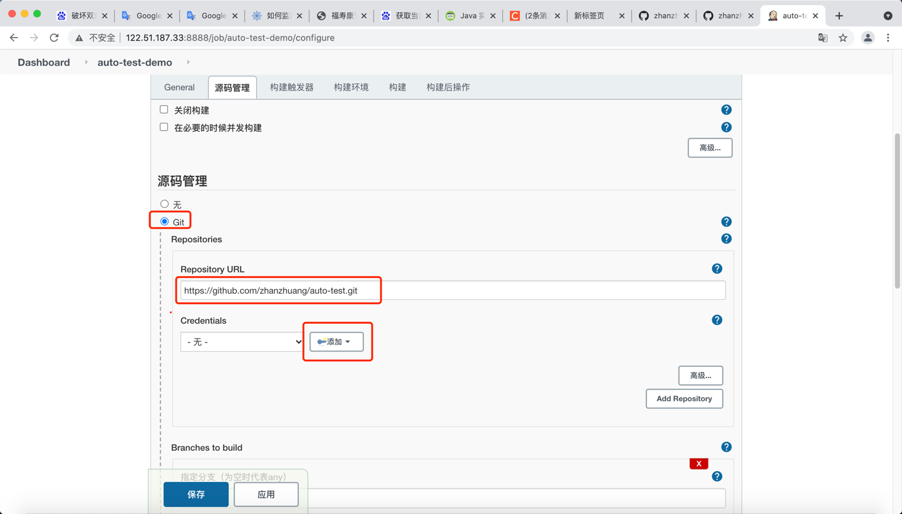

在弹出的证书配置界面添加github账号和密码后点击确定,如下所示
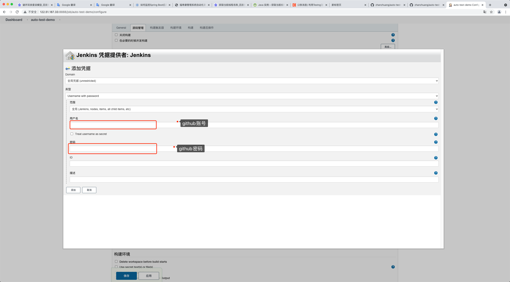

选择我们刚刚添加好的证书配置,如下所示
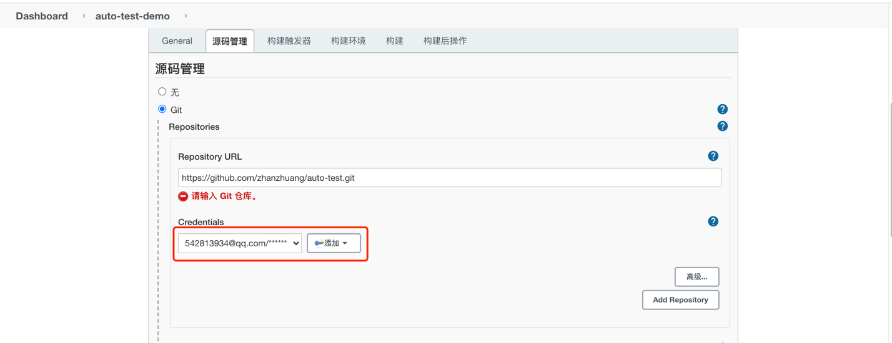

指定分支名,github在20年底新建仓库默认的主分支名从master变成了main.在构建/增加操作步骤下选择执行shell,如下所示
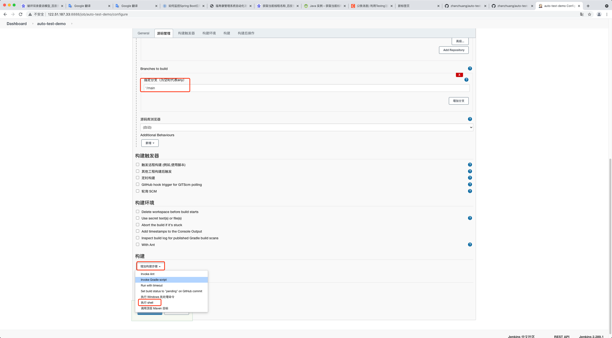
添加如下所示shell
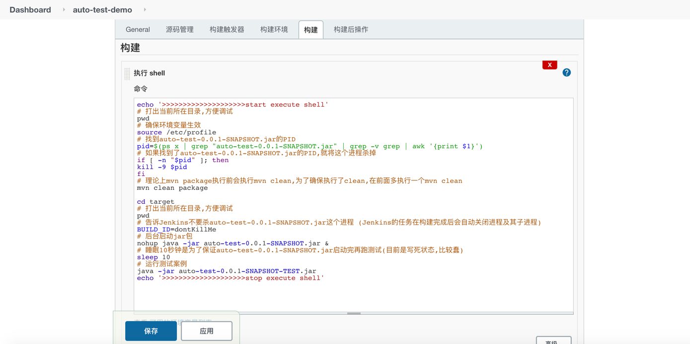
```shell
echo '>>>>>>>>>>>>>>>>>>>>start execute shell'
# 打出当前所在目录,方便调试
pwd
# 确保环境变量生效
source /etc/profile
# 找到auto-test-0.0.1-SNAPSHOT.jar的PID
pid=$(ps x | grep "auto-test-0.0.1-SNAPSHOT.jar" | grep -v grep | awk '{print $1}')
# 如果找到了auto-test-0.0.1-SNAPSHOT.jar的PID,就将这个进程杀掉
if [ -n "$pid" ]; then
kill -9 $pid
fi
# 理论上mvn package执行前会执行mvn clean,为了确保执行了clean,在前面多执行一个mvn clean
mvn clean package

cd target
# 打出当前所在目录,方便调试
pwd
# 告诉Jenkins不要杀auto-test-0.0.1-SNAPSHOT.jar这个进程 (Jenkins的任务在构建完成后会自动关闭进程及其子进程)
BUILD_ID=dontKillMe
# 后台启动jar包
nohup java -jar auto-test-0.0.1-SNAPSHOT.jar &
# 睡眠10秒钟是为了保证auto-test-0.0.1-SNAPSHOT.jar启动完再跑测试(目前是写死状态,比较蠢)
sleep 10
# 运行测试案例
java -jar auto-test-0.0.1-SNAPSHOT-TEST.jar
echo '>>>>>>>>>>>>>>>>>>>>stop execute shell'
```

点击保存和应用后回到Jenkins主页,刚才新建的Job会显示出来,点击下图所示按钮即可触发构建
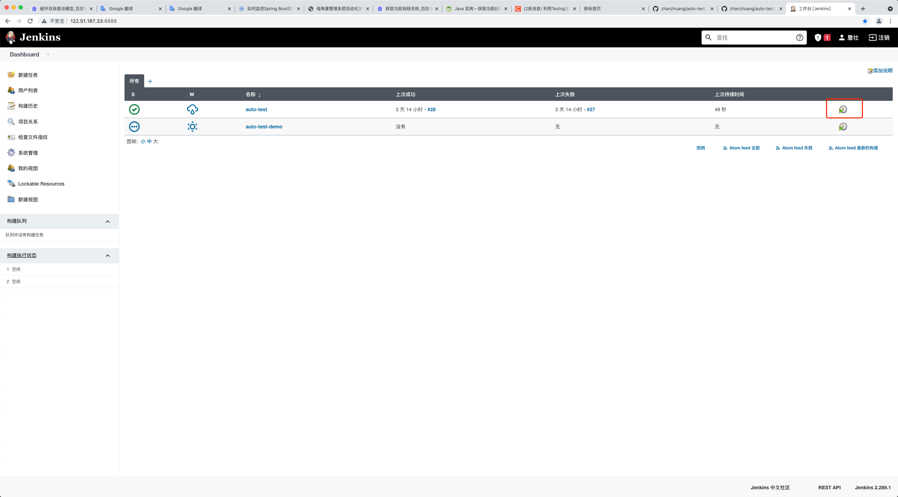

构建成功后Job的第一栏会有一个绿色的对号.如果构建失败,可以点进去Job的名称,在Build History处找到失败的构建记录,如下图所示
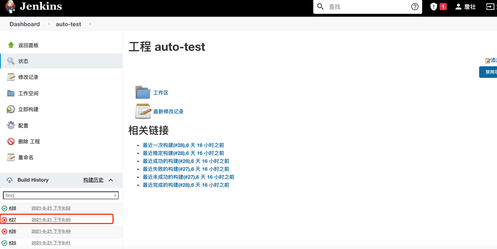
点击失败的构建记录,有控制台输出选项,点击控制台输出选项即可看到构建日志,如下图所示
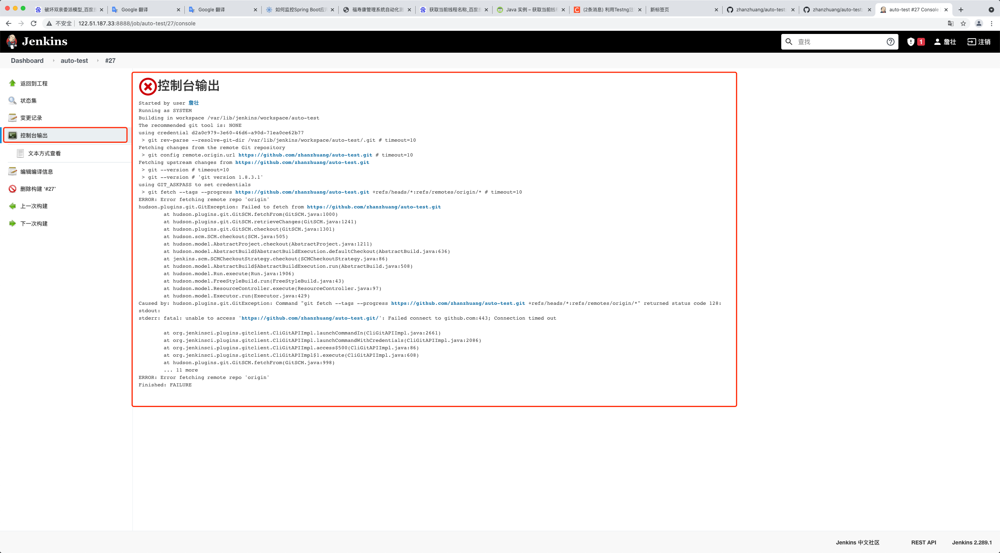

+ 3.常见问题
    + 3.1 Jenkins配置的git拉取github代码速度比较慢,使用镜像访问,配置宿主机器hosts文件,如下图所示
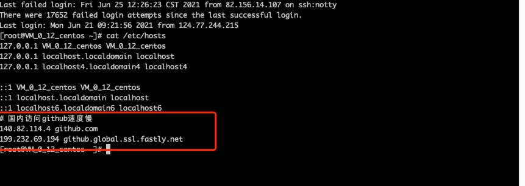
      ```shell
      # 国内访问github速度慢
      140.82.114.4 github.com
      199.232.69.194 github.global.ssl.fastly.net
      ```